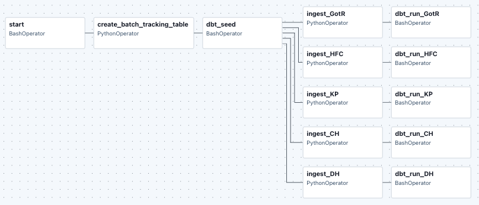
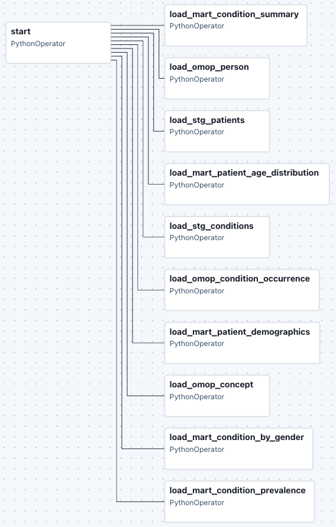
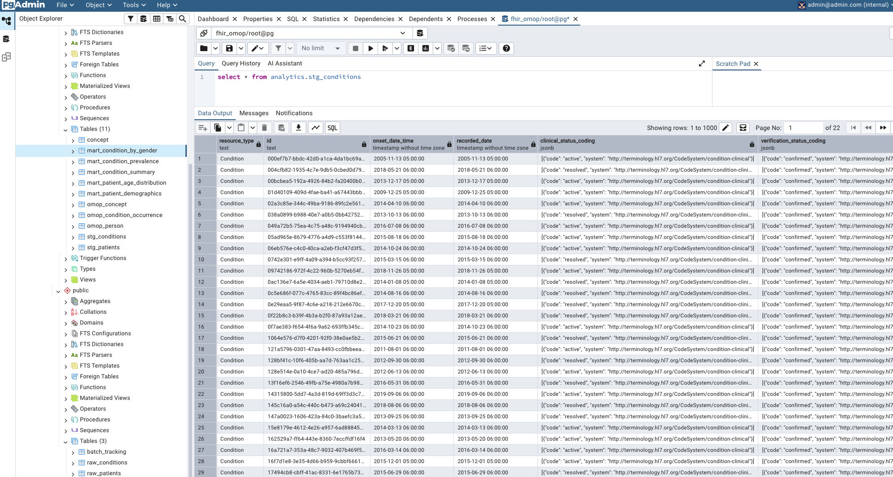
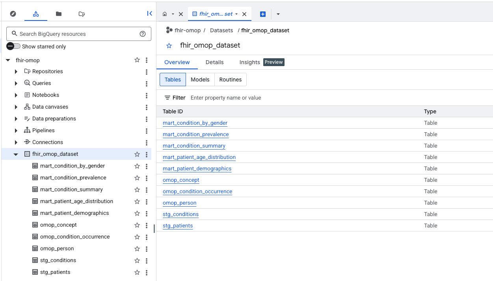
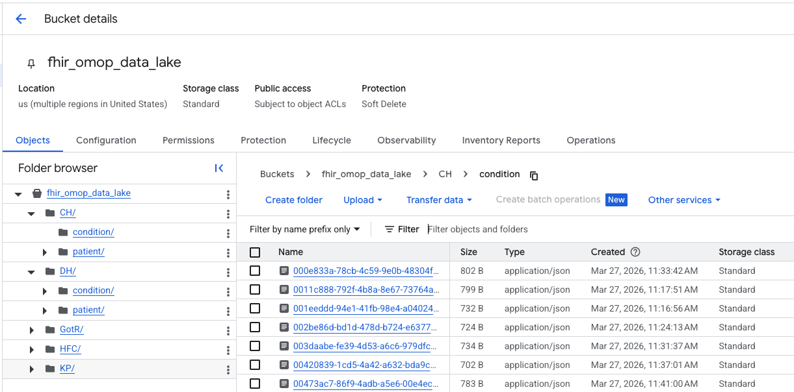
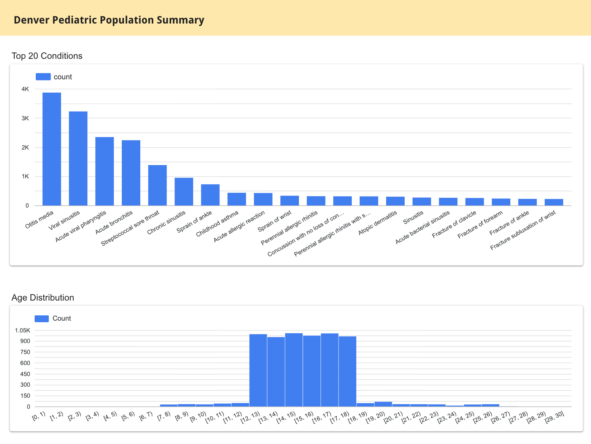

## Table of Contents
* [Tech Stack](#teck-stack)
* [Data Overview](#data-overview--problem-statement)
* [Project Overview](#project-overview)
* [Project Structure](#project-structure)
* [Data Flow](#data-flow)
* [Running the Project](#running-the-project)
* [Dashboard](#data-visualization-example-in-looker-studio)

## Overview
### Tech Stack
|                                           |                                                     |
|-------------------------------------------|-----------------------------------------------------|
| Python Environment & Dependency Management| UV                                                  |
| Infrastructure as Code (IaC)              | Terraform                                           |
| Orchestration                             | Airflow                                             |
| Data Modeling & Transformation            | dbt, Python, SQL                                    |
| Containerization                          | Docker                                              |
| Development Database                      | PostgreSQL                                          |
| Cloud Data Platform                       | Google Cloud Platform (GCP)                         |
| Data Lake                                 | Google Cloud Storage (GCS)                          |
| Data Warehouse                            | Google Cloud BigQuery                               |
| Data Visualization                        | Google Cloud Looker Studio                          |

### Data Overview / Problem Statement
**FHIR (Fast Healthcare Interoperability Resources)** is a modern standard for exchanging healthcare information electronically. It defines resources such as **Patient**, **Condition**, **Observation**, and more, which represent discrete clinical data elements. FHIR supports bundling multiple resources together in **FHIR Bundles**, enabling the transmission of complex patient datasets in a single package.

One of the main sources of FHIR data is from Electronic Health Records (EHRs). For this project, synthetic FHIR data was used to demonstrate the workflow. It is comprised of >6K simulated child patients residing in Colorado. Only **Patient** and **Condition** resources were selected for demonstration purposes, as the full FHIR dataset can be very large and complex to load and process. These resources are ingested into Postgres (dev) and BigQuery (prod) as semi-structured tables and also uploaded to GCS (json files). For more information on the source data, follow the instructions below to download the dataset, which includes additional documentation. For more information on FHIR resources and schemas visit https://hl7.org/fhir/R4/.

To enable consistent analytics across different datasets, the FHIR data, which is often deeply nested in JSON format and can make data analysis challenging, is transformed into the **OMOP Common Data Model**, a widely adopted clinical data model. OMOP provides a relational structure that standardizes and normalizes the data, making it suitable for downstream analytics. This approach bridges the gap between hierarchical FHIR data and relational analytics-ready models. For more information on OMOP visit https://www.ohdsi.org/data-standardization/. For more information on OMOP tables and schemas visit https://ohdsi.github.io/CommonDataModel/cdm54.html

Postgres serves as the development environment, while BigQuery is used for the finalized production tables.

### Project Overview
**Data Flow and Processes**  
Ingestion
* Batch Processing: Reads batches of JSON files from `data/ingest/Synthetic Denver/*` subdirectories. Each batch represents a synthetic provider.
* Batch Tracking: The status of each batch (uploaded to GCS and loaded into Postgres) is now stored in Postgres (batch_tracking table).
* Batch Ingestion:
    * Data is uploaded to Google Cloud Storage (GCS), organized by batch folders: `{batch}/patient/{id}.json` and `{batch}/condition/{id}.json`.
    * Data is loaded into Postgres (raw_patients and raw_conditions tables).
    * Before processing each batch, the system checks the Postgres batch_tracking table to determine if the batch has been uploaded to GCS and loaded into Postgres. If not, it will process the batch; otherwise, it will skip the batch.

DBT Models
* Staging Tables: DBT transforms data from the raw_patients and raw_conditions tables into staging tables (stg_patients, stg_conditions).
* Intermediate Tables: DBT then processes the staging tables into intermediate tables such as omop_person and omop_condition_occurrence, which are used for analytics.  
* Marts: DBT then processes the intermediate tables into marts such as mart_condition_summary, mart_patient_demographics, etc., which are used for downstream reporting and data visualization.

BigQuery Integration
* BigQuery: The final analytics tables are transferred from Postgres to BigQuery.

Airflow Orchestration
* Data pipelines are managed through Airflow DAGs with separate workflows for developent and production:
    * `dev_pipeline.py` -> Postgres
    * `prod_pipeline.py` -> BigQuery
    * DAGs
        * `fhir_omop_dev`. This will run the dev pipeline (Postgres)
        * `fhir_omop_prod`. This will run the prod pipeline (BigQuery)





### Project Structure
```
fhir_omop/
├── docker-compose.yml
├── Dockerfile
├── pyproject.toml
├── .env
├── data/
│   ├── ingest/
│   │   ├── ingest_data.py
│   │   └── helper_functions.py
│   └── Synthetic Denver/
│       ├── CH/
│       ├── DH/
│       ├── GotR/
│       ├── HFC/
│       └── KP/
├── creds/
│   └── keys.json
└── app/
    ├── airflow/
    │   ├── dags/
    |   |   ├── dev_pipeline.py
    |   |   └── prod_pipeline.py
    │   └── plugins/
    ├── dbt/
    │   └── fhir_omop/
    │       ├── models/
    │       │   ├── staging/
    │       │   │   ├── stg_patients.sql
    │       │   │   └── stg_conditions.sql
    │       │   ├── intermediate/
    │       │   │   ├── omop_person.sql
    │       │   │   ├── omop_condition_occurrence.sql
    |       |   │   └── omop_concept.sql
    │       │   └── marts/
    │       │       ├── mart_condition_summary.sql
    │       │       ├── mart_condition_prevalence.sql
    |       |       ├── mart_condition_by_gender.sql
    |       |       ├── mart_patient_demographics.sql   
    |       |   │   └── mart_patient_age_distribution.sql 
    │       ├── seeds/
    │       │   └── concept.csv
    │       └── dbt_project.yml
    └── terraform/
        └── ... (Terraform configs)
```

### Data Flow
```
       ┌─────────────────────┐
       │   Synthetic FHIR    │
       │    Bundles (JSON)   │
       └─────────┬───────────┘
                 │
                 ▼
           Batch ingestion
                 │
       ┌─────────┴─────────┐
       ▼                   ▼
┌─────────────────┐    ┌───────────────────┐
│   Postgres DB   │    │        GCS        │
│ raw_patients    │    │ {batch}/patient   │
│ raw_conditions  │    │ {batch}/condition │
│ batch_tracking  │    │                   │
└─────────┬───────┘    └───────────────────┘
          │
          │ dbt run (staging + intermediate)
          ▼
┌─────────────────────────────┐
│     Postgres analytics      │
│   stg_patients              │
│   stg_conditions            │
│   omop_person               │
│   omop_condition_occurrence │
│   omop_concept              │
│   mart_*                    │
└─────────────────────────────┘
         │
         │ BigQuery prod target
         ▼
┌─────────────────────────────┐
│       BigQuery dataset      │
└─────────────────────────────┘
```

## Running the Project
### Get Source Data
Due to its file size (>300 MB), the source data is not included in this repository. Use the commands to download the data. After extraction, there will be a directory named "Synthetic Denver" with multiple subdirectories.  
NOTE: Ensure the source data is unzipped under the **data** directory.
```
# Retrieve the source data
wget -O data.zip "https://mitre.box.com/shared/static/ydmcj2kpwzoyt6zndx4yfz163hfvyhd0.zip"

# Unzip into the 'data' directory
unzip -o data.zip -d data
```

### Configure environment variables
Review and update the .env file with the correct path to your GCP credentials. For example, this project is configured to use GCP credentials located at `/cred/keys.json`.

### Setup Google Cloud Storage Bucket and BigQuery Dataset
Before running the commands, review the `app/terraform/variables.tf` file to ensure that the path to your GCP credentials and the project ID are correctly set. For example, this project is configured to use GCP credentials located at `/cred/keys.json`. You can place the file in a different location, but you’ll need to update the path accordingly. Once verified, execute the following to create the GCS bucket and BigQuery dataset. You should be in the root directory when running the docker commands.
```
docker compose run terraform init
docker compose run terraform plan
docker compose run terraform apply
```

### Start Docker Services
```
docker compose up
```

### Access Airflow GUI
Go to http://localhost:8080/  
To obtain the username and password run the following
```
docker compose logs airflow | grep -i password
```
Once logged in, go to `Dags` and click on the trigger button for
* `fhir_omop_dev`. This will run the dev pipeline (Postgres)
* `fhir_omop_prod`. This will run the prod pipeline (BigQuery)
    * This DAG is dependent on running the dev pipeline first.  
NOTE: When running the dev pipline for the first time, this may take some time to complete the DAG workflow.

### Review the data in Postgres
Go to http://localhost:8085/  
Enter the following at login
* Email: admin@admin
* PW: root

Register server
* In the General tab, enter { Name: pg }
* In the Connection tab, enter { Host name/address: pgdatabase;  username: root; password: root}  
Then click save.

The raw_patients, raw_conditions, and batch_tracking tables are found within the public schema.  
The stg_patients, stg_conditions, omop_person, omop_condition_occurrence, omop_concept, and mart_* tables are found within the analytics schema.



### Review the data in BigQuery & GCS
Log in to your GCP console to review the data.





### Data Visualization Example in Looker Studio
[Visit Dashboard](https://lookerstudio.google.com/reporting/68e70eaa-0a6b-4aca-a0a1-3a8ca7e79a5f)

